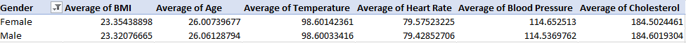
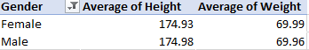
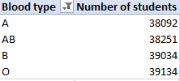
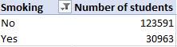
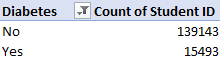

# Pivot tables

## Introduction

This task introduces pivot tables, how to clean and create pivot tables from a dataset.

## Skills Demonstrated 
Data cleaning.

## Problem statement

From a dataset provided, different pivot tables were supposed to be created displaying these informations:

- Creating a pivot table having 7 columns; Gender, Average age, Average BMI, Average temperature, Average heart rate, Average blood pressure, Average cholesterol. 

- Average height and weight for males and females in 2 decimal places.

- Number of students across different blood groups.

- Number of students who smoke and those who do not.

- Number of student who have diabetes and those who do not.

  
